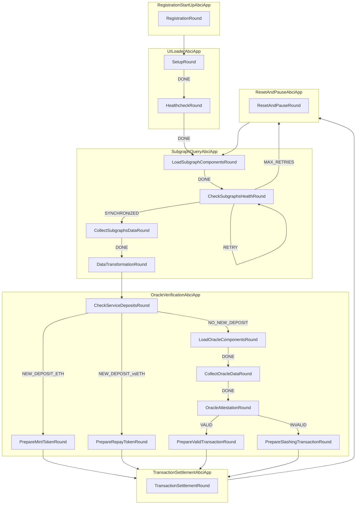

<h1 align="center">
    <b>Verification Station</b>
</h1>

<p align="center">
    <!-- Add badges here -->
</p>

<!-- ## Introduction -->


<!-- ## Requirements -->


<!-- ## Getting started -->

## Problem Statement
Current oracle systems assume the presence of "Watchers" who monitor and verify the accuracy and integrity of the data provided. These watchers are the other validators of the oracle network. Most of the time, these systems offer robust trustlessness guarantees. However, there are occasions when some security gets compromised in favor of greater efficiency bringing real-time data on-chain and reducing gas-cost. This raises a critical concern:

     "Who watches the Watchers?"

## How Verification Station addresses these issues:

"Don't Trust, Verify"

Verification Station offers a solution grounded in the principle of "Don't Trust, Verify." This approach empowers users to take control of their data verification process rather than relying solely on oracle network validators.

1. **Individually-operated Autonomous Agent**:
Verification Station provides an autonomous agent that users can run and customize to verify the oracle data they depend on. This allows users to independently validate the data without having to place their trust entirely in the oracle service operators. The validation process occurs off-chain, consuming only computation power and electricity, thus maintaining efficiency and reducing costs. Furthermore, this autonomous agent can be operated in a fully privacy-preserving manner, since all verification is conducted off-chain.

2. **Decentralized Multi-Agent Verification Service**:
Beyond individual use, the autonomous agent can operate as part of a collective multi-agent service. This service can be permissionlessly joined by any interested party within the decentralized ecosystem. The findings of this service are published on-chain for complete transparency. By operating as a decentralized multi-agent service, it acts as a common good, contributing to the overall trust and integrity of the oracle network for the benefit of the entire ecosystem.

## Operational Overview

Here's how it works:
- **Autonomous Watcher**: Deploy a network of nodes that continuously monitor the validity of oracle data across blockchains, thereby strengthening the Web3 ecosystem's security by autonomously verifying and slashing misbehaving oracles.
- **Chain-Agnostic Operation**: Ensure the service operates across multiple blockchain networks, providing a versatile solution for the entire Web3 ecosystem.
- **Transparent and Permissionless**: Enable anyone to participate by deploying their own watcher node or contributing to the community fund, ensuring broad participation and decentralization.
- **Economic Incentives**: Reward participants for detecting and verifying misbehavior by slashing offending oracles and distributing rewards to the community fund.
- **Public Auditing and Dashboard**: Provide a public dashboard displaying real-time status and activity of all watcher nodes, ensuring transparency and trustworthiness.

## Demo
Video Demo -  https://drive.google.com/drive/folders/1RDeZcC8Dq2deGe981xkjPhwFS2su9d9d?usp=drive_link

### Overview of the Finite State Machine design



## Requirements

- Git
- [Poetry](https://github.com/python-poetry/poetry)
- [Docker](https://github.com/docker)
- Protocol buffers v24.3
    ```shell
    wget https://github.com/protocolbuffers/protobuf/releases/download/v24.3/protoc-24.3-linux-x86_64.zip && unzip protoc-24.3-linux-x86_64.zip -d protoc && sudo mv protoc/bin/protoc /usr/local/bin/protoc
    ```
- [Tendermint](https://docs.tendermint.com/v0.34/introduction/install.html) `==0.34.19`

## Install from source

Clone the repository:

```shell
git clone git@github.com:Karrenbelt/verification-station.git
cd verification-station && make
```

Initialize the `autonomy` cli tool and set the remote IPFS node

```shell
autonomy init --reset --author $(whoami) --remote --ipfs --ipfs-node "/dns/registry.autonolas.tech/tcp/443/https"
```

then synchronize the third party application components.

```shell
autonomy packages sync
```

NOTE: you might try again in case you experience a timeout.


## 1. Run Tendermint

Either containerized
```shell
docker pull tendermint/tendermint:v0.34.19
```

or, alternatively, run the node locally
```shell
wget https://github.com/tendermint/tendermint/releases/download/v0.34.19/tendermint_0.34.19_linux_amd64.tar.gz
tar -xf tendermint_0.34.19_linux_amd64.tar.gz
sudo mv tendermint /usr/local/bin/tendermint
```

change the permissions
```shell
GROUP=$(id -gn)
sudo chown -R $(whoami):$GROUP /home/$(whoami)/tendermint_data
```

Run the Tendermint node:
```shell
../scripts/run_tendermint.sh
```

## 2. Run the agent

```shell
../scripts/start_single_agent.sh zarathustra/oracle_verifier
```

## Deployed Contracts

vsToken - https://sepolia.etherscan.io/address/0xDb98aC0aaAE7576331B4b73C5F0BDeF6e9674Ccf
vsVault - https://sepolia.etherscan.io/address/0x225171943a0Dd2f33dc35c4D14F7B5abB5aFBE93 && https://repo.sourcify.dev/contracts/full_match/11155111/0x225171943a0Dd2f33dc35c4D14F7B5abB5aFBE93/
Status - https://sepolia.etherscan.io/address/0x4600a46751c3969261361cadb515bd00b2e284b1


## Contributing
Learn how to contribute to the project by following the guidelines in [CONTRIBUTING.md](CONTRIBUTING.md).

## Changelog
Explore the project's version history and changes in [CHANGELOG.md](CHANGELOG.md).

## Documents
Read the full documentation of the project on our [Gitbook](https://sentinel-7.gitbook.io/watchers) 

## Deck 
Link to our Pitchdeck for the Eth Global Hackaton 07/2024 [Pitchdeck](https://docs.google.com/presentation/d/1Ky_-xIcaxrwOF5vf9qH14P0C5zTRnaz_pBBtip-Vr9A/edit?usp=sharing)

## License
This project is licensed under the [Apache2.0 license](LICENSE).
