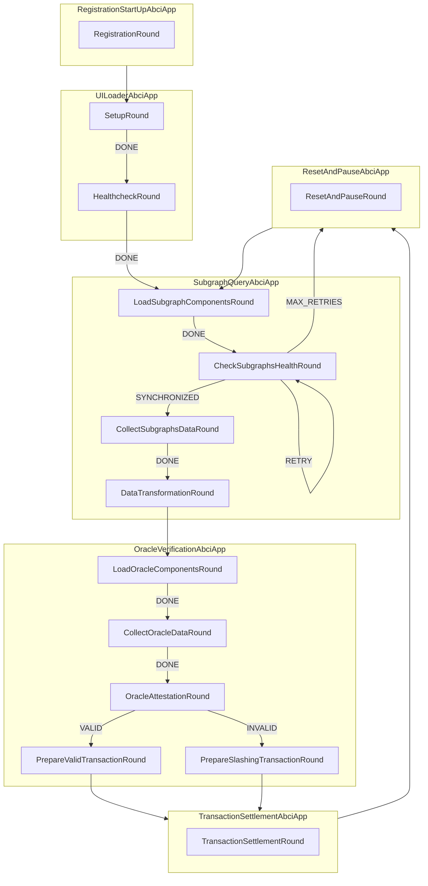

<h1 align="center">
    <b>Verification Station</b>
</h1>

<p align="center">
    <!-- Add badges here -->
</p>

<!-- ## Introduction -->


<!-- ## Requirements -->


<!-- ## Getting started -->

## Problem Statement
Current oracle systems assume the presence of "Watchers" who monitor and verify the accuracy and integrity of the data provided. These watchers are the other validators of the oracle network. Most of the time, these systems offer robust trustlessness guarantees. However, there are occasions when some security gets compromised in favor of greater efficiency bringing real-time data on-chain and reducing gas-cost. This raises a critical concern:

     "Who watches the Watchers?"


### Overview of the Finite State Machine design




## Install from source

Clone the repository:

```shell
git clone git@github.com:Karrenbelt/verification_station.git
```

## Contributing
Learn how to contribute to the project by following the guidelines in [CONTRIBUTING.md](CONTRIBUTING.md).

## Changelog
Explore the project's version history and changes in [CHANGELOG.md](CHANGELOG.md).

## License
This project is licensed under the [Apache2.0 license](LICENSE).
