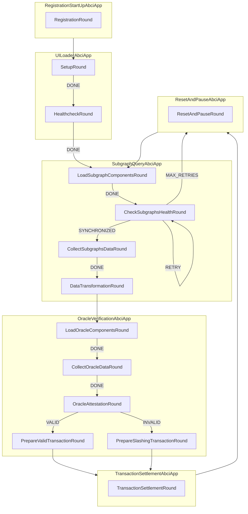

<h1 align="center">
    <b>Verification Station</b>
</h1>

<p align="center">
    <!-- Add badges here -->
</p>

<!-- ## Introduction -->


<!-- ## Requirements -->


<!-- ## Getting started -->

## Problem Statement
Current oracle systems assume the presence of "Watchers" who monitor and verify the accuracy and integrity of the data provided. These watchers are the other validators of the oracle network. Most of the time, these systems offer robust trustlessness guarantees. However, there are occasions when some security gets compromised in favor of greater efficiency bringing real-time data on-chain and reducing gas-cost. This raises a critical concern:

     "Who watches the Watchers?"

## How Verification Station addresses these issues:
Verification Station addresses these challenges by providing an independent, chain-agnostic service that autonomously monitors and slashes misbehaving oracles. Here's how it works:
- **Autonomous Watcher**: Deploy a network of nodes that continuously monitor the validity of oracle data across blockchains, thereby strengthening the Web3 ecosystem's security by autonomously verifying and slashing misbehaving oracles.
- **Chain-Agnostic Operation**: Ensure the service operates across multiple blockchain networks, providing a versatile solution for the entire Web3 ecosystem.
- **Transparent and Permissionless**: Enable anyone to participate by deploying their own watcher node or contributing to the community fund, ensuring broad participation and decentralization.
- **Economic Incentives**: Reward participants for detecting and verifying misbehavior by slashing offending oracles and distributing rewards to the community fund.
- **Public Auditing and Dashboard**: Provide a public dashboard displaying real-time status and activity of all watcher nodes, ensuring transparency and trustworthiness.


### Overview of the Finite State Machine design




## Install from source

Clone the repository:

```shell
git clone git@github.com:Karrenbelt/verification_station.git
```

## Contributing
Learn how to contribute to the project by following the guidelines in [CONTRIBUTING.md](CONTRIBUTING.md).

## Changelog
Explore the project's version history and changes in [CHANGELOG.md](CHANGELOG.md).

## License
This project is licensed under the [Apache2.0 license](LICENSE).
